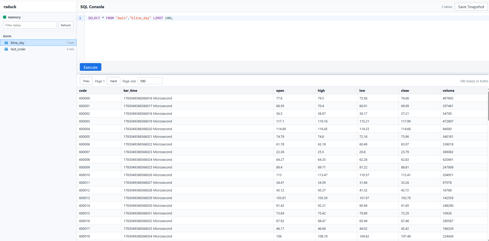
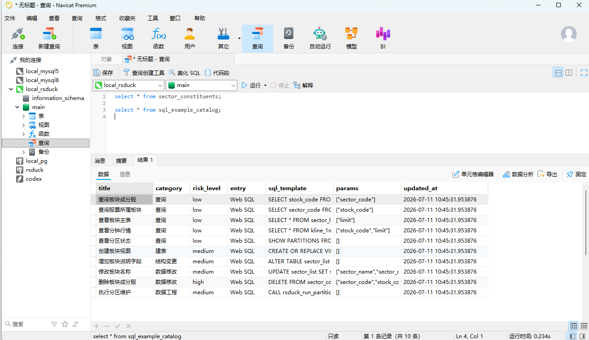
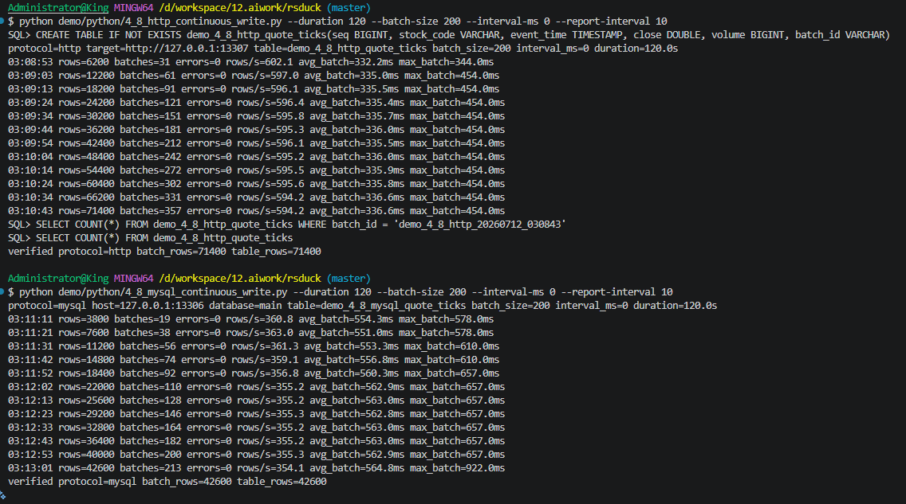

# rsduck introduction

Language: English | [中文](README.zh-CN.md)

<p align="center">
  <a href="console.png"></a>
  <br>
  <sub>Web SQL Console</sub>
</p>

<p align="center">
  <a href="navicat_query.png"></a>
  <br>
  <sub>Navicat through the MySQL wire protocol</sub>
</p>

## Measured Continuous Writes

<p align="center">
  <a href="yace.png"></a>
  <br>
  <sub>Local 120-second continuous-write run, batch size 200, no intentional interval</sub>
</p>

The two runnable demos use the same generated rows and batch size against separate ordinary tables. In this local run, the HTTP path consistently completed more batches than the PyMySQL MySQL-wire path:

| Metric | HTTP | MySQL wire |
|---|---:|---:|
| Rows written | 71,400 | 42,600 |
| Steady throughput | ~595 rows/s | ~355 rows/s |
| Average batch latency | ~336 ms | ~564 ms |
| Maximum batch latency | 454 ms | 922 ms |

This is a reproducible product-path measurement, not a universal database benchmark: both paths ultimately use RSDuck's one serialized write worker, and results depend on the table shape, batch size, host, and background activity. Use the [HTTP](demo/python/4_8_http_continuous_write.py) and [MySQL wire](demo/python/4_8_mysql_continuous_write.py) demos to repeat the comparison.

Related documents:

- [Architecture overview](doc/architecture-overview.en.md)
- [Catalog and permission design](doc/mysql-compat-auth-catalog-design.en.md)
- [Practical examples](doc/rsduck-practical-examples.en.md)
- [RSDuck Agent vector memory retrieval: principles, strengths, and example](doc/rsduck-vector-memory-overview.en.md)
- [Agent vector memory retrieval and indexing contract](doc/agent-vector-memory.md)

This document is for engineers who need to run, integrate, maintain, or continue developing rsduck. It describes the current code behavior, with emphasis on what is supported, what is not supported, how failures should be handled, and which constraints must be preserved when adding new capabilities.

## 1. Project Positioning

rsduck is an in-memory database service built on DuckDB. It exposes:

- A MySQL wire protocol endpoint for Navicat and MySQL clients.
- A Web SQL console with query, pagination, snapshot, and Parquet table import features.
- The `rsduck_catalog.rs_*` metadata and privilege system.
- Ordinary tables, views, indexes, users, roles, and managed range-partitioned tables.
- Fixed-dimension `FLOAT[N]` vectors, catalog-managed VSS/HNSW indexes, and a dedicated Vector API.
- Windows, Linux, and macOS system-service packages, login-session tray controls, and verified updates.
- Snapshot v3 persistence and restore.

rsduck is not MySQL, and it is not a transparent proxy that exposes every native DuckDB capability. It follows these principles:

1. DuckDB stores physical objects and business data.
2. `rsduck_catalog.rs_*` is the single source of truth for managed objects, privileges, dependencies, and snapshot metadata.
3. Every external DDL operation must update both DuckDB physical objects and the rsduck catalog.
4. Unsupported capabilities return clear errors. They do not fall back to DuckDB internal catalog tables or older implementation paths.
5. External SQL accepts only one statement per request.

## 2. Core Architecture

```text
MySQL client / Navicat          Web console
           |                         |
           +-----------+-------------+
                       |
                 SQL route + auth
                       |
          +------------+-------------+
          |                          |
    read worker pool             write worker
    N DuckDB connections         1 DuckDB connection
          |                          |
          +-------------+------------+
                        |
               in-memory DuckDB
          +-------------+-------------+
          |                           |
   business objects         rsduck_catalog.rs_*
                                      |
                              snapshot worker
```

Runtime connection model:

- One base in-memory DuckDB instance.
- One serialized write worker.
- `db.read_workers` read workers. Queries are assigned by round-robin.
- One independent snapshot worker.
- Writes and snapshots are serialized through the same gate, so catalog and business data do not change while export is running.

This means:

- Two independent queries are not guaranteed to run on the same read connection.
- DuckDB temporary tables are connection-scoped objects and cannot be reliably reused across two external requests.
- Explicit transactions cannot span Web/MySQL requests.
- The program may implement internal composite tasks pinned to one worker, but that is not the same as exposing external multi-statement SQL.

## 3. Quick Start

### 3.1 Requirements

- Rust stable toolchain.
- Windows PowerShell or another terminal that can run Cargo.
- DuckDB does not need to be installed separately. The project uses the `bundled` feature of the `duckdb` crate.

### 3.2 Development Mode

```powershell
cargo build
cargo run
```

The service reads the following files and directories from the **current working directory**:

- `rsduck.toml`
- `init.sql`
- `snapshot/`
- `logs/`
- `.rsduck.lock`

Do not start the executable from an uncertain working directory. Windows service deployment must also configure the correct working directory.

The repository `rsduck.toml` uses:

```text
MySQL: 127.0.0.1:13306
Web:   http://127.0.0.1:13307
```

If `rsduck.toml` does not exist, the code default Web port is also `13307`.

Initial administrator account:

```text
username: admin
password: admin
```

Change the password immediately after first startup:

```sql
ALTER USER admin PASSWORD 'replace_with_a_strong_password';
```

### 3.3 Shutdown

Prefer normal termination signals. A graceful shutdown saves one final snapshot before stopping workers.

Force-killing the process may skip the shutdown snapshot. If `.rsduck.lock` remains after an abnormal exit, confirm that the recorded PID no longer exists before handling the lock file. Do not delete the lock file and start a second instance while the first instance is still running.

## 4. Configuration

Full configuration example:

```toml
[log]
level = "info"
dir = "logs"
file_prefix = "rsduck"
retain_files = 3
console = false

[db]
init_sql = "init.sql"
read_workers = 4
write_queue_size = 100000
read_queue_size = 1024
snapshot_queue_size = 16
max_result_rows = 100000
extension_dir = "extensions"
vss_enabled = true

[snapshot]
restore_on_startup = true
dir = "snapshot"
prefix = "rsduck"
interval_secs = 900
retain_hours = 2

[partition]
maintenance_enabled = true
maintenance_interval_secs = 60
verify_interval_secs = 300
max_jobs_per_tick = 100

[mysql]
bind = "127.0.0.1:13306"

[web]
enabled = true
bind = "127.0.0.1:13307"
parquet_import_root = "."

[web.vector_api_limits]
max_body_bytes = 33554432
max_concurrent_requests = 64
search_timeout_ms = 5000
write_timeout_ms = 30000
maintenance_timeout_ms = 300000
```

### 4.1 Configuration Rules

- Configuration structs use `deny_unknown_fields`. A misspelled field fails startup instead of being ignored silently.
- Relative paths are resolved from the process working directory.
- `read_workers` is treated as at least 1.
- When a queue reaches its capacity, rsduck returns a clear queue full error. It does not switch to another execution path automatically.
- `max_result_rows` is the server-side maximum result size for one request. It is not the same as the Web page size.
- `snapshot.prefix` only accepts safe snapshot directory prefixes. An unsafe prefix prevents startup.
- `parquet_import_root` is the root directory allowed for Web Parquet import. Import requests may only use relative paths under this directory.
- When `vss_enabled = true`, a VSS build matching the current DuckDB version and platform must exist under `extension_dir` before startup. Missing or unloadable VSS files produce a clear error and never trigger an implicit exact-scan fallback.
- Configure Vector API tokens through `[[web.vector_api_tokens]]`, scoped by operation, tenant, agent, and vector space. Never commit real tokens to the repository.

### 4.2 Startup Data Sources

Startup order:

1. Acquire `.rsduck.lock` to prevent multiple instances from using the same working directory.
2. If `restore_on_startup = true`, find the latest valid Snapshot v3.
3. If a snapshot is found, restore catalog and business objects from it.
4. If no snapshot exists, create a fresh rsduck catalog.
5. For a fresh database, execute initialization SQL when `db.init_sql` is not empty.
6. Start read workers, the write worker, the snapshot worker, and MySQL/Web services.

`init.sql` is an internal initialization entry point and may contain multiple statements. It is not subject to the external one-statement rule, but each DDL statement must still go through catalog-aware mutation.

## 5. Catalog Rules

### 5.1 Single Source Of Truth

Managed metadata is stored in `rsduck_catalog`:

```text
rs_catalog_version   catalog version, epoch, checksum
rs_oid_alloc         OID allocator
rs_catalog_journal   catalog mutation journal
rs_schema            schemas
rs_type              types
rs_relation          tables, views, indexes, and other relations
rs_column            columns
rs_column_default    column defaults
rs_constraint        primary keys, unique constraints, foreign keys, check constraints
rs_index             indexes
rs_vector_index      vector spaces, HNSW definitions, physical generations, and runtime state
rs_dependency        object dependencies
rs_comment           comments
rs_relation_ext      rsduck extension attributes
rs_partition         partition state
rs_user              users
rs_role              roles
rs_user_role         user-role relations
rs_privilege         privileges
```

External clients must not write these tables directly. The following schemas are reserved:

```text
rsduck_catalog
rsduck_internal
pg_catalog
information_schema
```

`information_schema`, `SHOW ...`, and the MySQL system tables used by Navicat are controlled projections. They are not writable catalog tables.

### 5.2 Required DDL Atomicity

Every new DDL or management command must handle all of the following together:

1. Authorization.
2. A pending catalog journal record.
3. DuckDB physical object mutation.
4. `rs_relation`, `rs_column`, dependency, and other catalog records.
5. Journal completion state.
6. Catalog epoch and checksum.
7. Physical object and catalog rollback on failure.

Do not execute native DuckDB DDL first and then try to fill catalog rows afterward. That creates objects that Navicat cannot see, privileges cannot protect, or snapshots may miss.

## 6. SQL Execution Rules

### 6.1 External Requests Accept One Statement Only

Allowed:

```sql
SELECT * FROM main.kline_day;
```

Rejected:

```sql
SELECT 1;
SELECT 2;
```

Rejecting multiple statements is an rsduck routing constraint, not a native DuckDB limitation. The reasons include:

- One request can determine only one read/write route.
- The Web API currently returns one result set.
- MySQL multi-results are not implemented as a public protocol capability.
- Each statement must be authorized independently.
- Transactions or temporary objects must not leak into later user requests.

### 6.2 Do Not Use Explicit Transactions Across Requests

The following usage is not part of the supported contract:

```sql
BEGIN;
```

Then, in a later request:

```sql
INSERT INTO ...;
COMMIT;
```

Server-side worker connections are shared by many requests. External requests do not have transaction-bound connections. When atomic behavior is required, add a clearly defined internal composite command and complete it within one worker invocation.

### 6.3 Temporary Tables

DuckDB natively supports `CREATE TEMP TABLE`, but rsduck currently rejects temporary table creation from Web/MySQL:

```sql
CREATE TEMP TABLE temp_t AS SELECT ...; -- not supported through external entry points
```

Program internals may run pre-SQL, the main query, and cleanup SQL sequentially on the same worker and the same `Connection`. Prefer a typed internal command over a generic public multi-statement string:

```rust
// Design example, not a current public API
BEGIN;
CREATE TEMP TABLE temp_t AS ...;
SELECT ... FROM temp_t;
ROLLBACK;
```

This is suitable for scheduler pre-SQL, intermediate result reuse, and complex analysis. Requirements:

- The whole task is pinned to one connection.
- Pre-SQL may only modify temporary objects.
- Cleanup or rollback runs on both success and failure.
- Only the main query result is returned.
- Temporary tables are not registered in the rsduck catalog or snapshots.

For one-off intermediate results, prefer a CTE:

```sql
WITH prepared AS MATERIALIZED (
    SELECT code, avg(close) AS avg_close
    FROM main.kline_day
    GROUP BY code
)
SELECT * FROM prepared WHERE avg_close > 10;
```

## 7. Supported Objects And Limits

### 7.1 Queries And DML

Mainly supported:

- `SELECT`, `WITH`, `EXPLAIN`
- `SHOW TABLES`, `SHOW COLUMNS`, `SHOW INDEX`
- `DESCRIBE`
- `INSERT`, `UPDATE`, `DELETE`
- `COPY table TO ...`
- `COPY table FROM ...`

Queries go to read workers. Write operations go to the serialized write worker.

### 7.2 DDL Support Matrix

| Capability | Status | Constraints |
|---|---|---|
| `CREATE SCHEMA` | Supported | Requires system `manage_catalog` |
| `CREATE TABLE` | Supported | Must create a managed ordinary table |
| `CREATE TABLE AS SELECT` | Not supported from external SQL | Web Parquet import uses a dedicated catalog-aware implementation |
| `CREATE TEMP TABLE` | Not supported from external SQL | Recommended only for internal same-connection tasks |
| `ALTER TABLE ADD COLUMN` | Supported | Column position is not supported |
| `ALTER TABLE DROP COLUMN` | Supported | Protected by dependencies from constraints, indexes, foreign keys, and partition keys |
| `CREATE VIEW` | Supported | Temporary views and `OR REPLACE` are not supported |
| `CREATE INDEX` | Supported | Must be explicitly named. Partial, INCLUDE, and expression indexes are not supported |
| Catalog-managed HNSW | Supported | Managed only through the Vector API; the first release supports one `FLOAT[N]` column on an ordinary non-partitioned table |
| `COMMENT ON` | Supported | Schemas, tables, views, indexes, and columns |
| `CREATE USER/ROLE` | Supported | Users must have passwords |
| `GRANT/REVOKE` | Supported | Uses rsduck-mapped read/write/ddl/system privileges |
| Managed range partition table | Supported | Uses rsduck extension syntax |

### 7.3 Managed Column Types

When creating catalog-managed tables, the currently supported types are:

```text
BOOLEAN
SMALLINT
INTEGER
BIGINT
REAL
DOUBLE
DECIMAL / NUMERIC
VARCHAR / TEXT
DATE
TIME
TIMESTAMP
```

Fixed-dimension vector type:

```text
FLOAT[N]
```

`FLOAT[N]` preserves its dimension contract through DDL, parameter binding, MySQL/Web query results, JSON, Parquet snapshots, and restore. The Vector API can create a catalog-managed HNSW index on one `FLOAT[N]` column of an ordinary non-partitioned table, using `cosine`, `l2sq`, or `ip` distance.

Complex column types:

```text
<simple_type>[]
STRUCT(field_name <simple_type>, ...)
MAP(<simple_type>, <simple_type>)
```

rsduck supports DuckDB native complex column types, but complex types may not nest other complex types. Complex type internals may only use simple scalar types. Query results serialize complex values as JSON.

Generic complex columns (arrays, STRUCT, and MAP) may be used as ordinary data columns, but are not supported as primary keys, unique keys, index columns, foreign keys, partition keys, or non-`NULL` default values. Managed HNSW on `FLOAT[N]` is a dedicated exception and does not enable arbitrary complex-column indexes. DuckDB supports more types, but if rsduck has no catalog mapping for a physical type, DDL or Parquet import fails and rolls back. Do not assume that a type is supported in rsduck-managed tables only because native DuckDB can create it.

## 8. Ordinary Table Examples

### 8.1 Create Schema And Table

```sql
CREATE SCHEMA market;
```

```sql
CREATE TABLE market.daily_quote (
    code       VARCHAR NOT NULL,
    trade_date DATE NOT NULL,
    open       DOUBLE,
    high       DOUBLE,
    low        DOUBLE,
    close      DOUBLE,
    volume     BIGINT,
    PRIMARY KEY (code, trade_date)
);
```

### 8.2 Insert And Query

```sql
INSERT INTO market.daily_quote
    (code, trade_date, open, high, low, close, volume)
VALUES
    ('600000', DATE '2026-07-10', 10.1, 10.8, 9.9, 10.6, 1200000);
```

```sql
SELECT code, trade_date, close
FROM market.daily_quote
WHERE code = '600000'
ORDER BY trade_date DESC
LIMIT 100;
```

### 8.3 Indexes, Views, And Comments

```sql
CREATE INDEX idx_daily_quote_date
ON market.daily_quote(trade_date);
```

```sql
CREATE VIEW market.latest_quote AS
SELECT code, max(trade_date) AS latest_date
FROM market.daily_quote
GROUP BY code;
```

```sql
COMMENT ON TABLE market.daily_quote IS 'daily unadjusted quotes';
```

```sql
COMMENT ON COLUMN market.daily_quote.close IS 'closing price';
```

## 9. User, Role, And Privilege Examples

Built-in roles:

```text
admin     full management capability
operator  snapshot and catalog operation capability
ddl       predefined DDL role name; actual access is still determined by privilege records
writer    predefined write role name; actual access is still determined by privilege records
reader    predefined read role name; actual access is still determined by privilege records
```

Create a user and a role:

```sql
CREATE USER quant_reader PASSWORD='replace_me';
```

```sql
CREATE ROLE analyst;
```

Grant relation access and grant the role to the user:

```sql
GRANT SELECT ON TABLE market.daily_quote TO ROLE analyst;
```

```sql
GRANT ROLE analyst TO quant_reader;
```

Grant directly to a user:

```sql
GRANT SELECT ON TABLE market.daily_quote TO quant_reader;
GRANT INSERT ON TABLE market.daily_quote TO quant_reader;
GRANT CREATE ON SCHEMA market TO quant_reader;
```

Revoke:

```sql
REVOKE SELECT ON TABLE market.daily_quote FROM quant_reader;
REVOKE ROLE analyst FROM quant_reader;
```

Privilege mapping:

- relation `SELECT/READ/USAGE` -> `read`
- relation `INSERT/UPDATE/DELETE` -> `write`
- relation `CREATE/DROP/OWNERSHIP` -> `ddl`
- schema `SELECT/READ/USAGE` -> `read`
- schema `CREATE/DROP/OWNERSHIP` -> `ddl`
- system management actions -> `manage_snapshot`, `manage_catalog`, `manage_user`

Do not modify `rs_privilege` directly. Use `GRANT/REVOKE` so journal, checksum, and audit state stay consistent.

## 10. Managed Range-Partitioned Tables

Create a table partitioned by day and retain 30 partitions:

```sql
CREATE TABLE ods_access_log (
    id          BIGINT,
    access_time TIMESTAMP NOT NULL,
    content     TEXT
)
PARTITION BY RANGE (access_time)
WITH (
    partition_unit = 'day',
    retention = '30'
);
```

Insert into the parent table:

```sql
INSERT INTO ods_access_log(id, access_time, content)
VALUES (1, TIMESTAMP '2026-07-10 10:00:00', 'ok');
```

rsduck will:

1. Compute the partition value from the partition key.
2. Create the physical partition under `rsduck_internal`.
3. Write `rs_partition`.
4. Refresh the parent table query entry.
5. Clean expired partitions according to the retention rule.

Do not operate on physical partitions under `rsduck_internal` directly.

Maintenance commands:

```sql
CALL rsduck_run_partition_maintenance();
```

```sql
CALL rsduck_mark_partition_unavailable(
    'ods_access_log',
    '20260710',
    'manual reason'
);
```

```sql
CALL rsduck_repair_partition('ods_access_log', '20260710');
```

These commands require `manage_catalog`.

## 11. Web Parquet Table Import

The **Import Parquet** button in the Web sidebar copies existing Parquet data into the rsduck in-memory database and registers it as catalog-managed ordinary tables.

### 11.1 Input Model

- One `.parquet` file represents one logical table.
- Selecting a directory imports all top-level `.parquet` files in that directory.
- Directory mode treats data as one file per table.
- The default table name is the file name without extension.
- A custom target table name is allowed only in single-file mode.
- One batch may contain at most 256 files.

If several Parquet files are shards of the same logical table, current directory mode treats them as multiple tables and does not union them automatically. Merge that data first, or implement an explicit Parquet Dataset import mode later.

### 11.2 Path Rules

Configuration:

```toml
[web]
parquet_import_root = "D:/data/rsduck-import"
```

The Web form may only submit paths relative to that root:

```text
single/quotes.parquet
batch_20260710
```

Absolute paths are not allowed. `..` and symbolic-link escapes from the root are not allowed.

### 11.3 Import Semantics

- All imported objects are ordinary tables, with `managed_kind = ordinary`.
- Data is copied into in-memory DuckDB. After success, the source files do not need to remain available.
- Existing tables are not overwritten.
- Batch import is atomic. If any file fails, the whole batch rolls back.
- Parquet provides only data and column types. Primary keys, indexes, comments, owners, and original database privileges are not restored.
- Unsupported column types fail the whole batch.

After import, create indexes, constraints, comments, and privileges separately as needed.

## 12. Snapshot v3

Snapshot directory structure:

```text
snapshot/
  rsduck_20260710_120000/
    manifest.json
    catalog.duckdb
    data/
      10005.parquet
      10022.parquet
```

File responsibilities:

- `manifest.json`: format version, snapshot name, catalog epoch/checksum, table files, row counts, view and macro DDL/checksum.
- `catalog.duckdb`: one DuckDB file containing all `rs_*` catalog tables.
- `data/*.parquet`: one business data file for each ordinary physical relation.

### 12.1 Save Triggers

- Periodic save according to `snapshot.interval_secs`.
- Manual save through the **Save Snapshot** button in the Web upper-right toolbar.
- Save before graceful shutdown.

Snapshot save is serialized with the write worker. Export uses a temporary directory and atomically renames it on success. Failed exports clean up the temporary directory.

### 12.2 Restore Rules

Restore order:

1. catalog
2. schema
3. ordinary table data
4. indexes
5. views
6. macros/functions
7. checksum and catalog/physical consistency checks

Key failure behavior:

- Catalog format version mismatch: startup fails.
- Manifest catalog epoch/checksum mismatch: startup fails.
- Table data row count mismatch: restore fails.
- View or macro DDL checksum tampering: restore fails.
- A missing business data file marks the corresponding relation unavailable. Other objects continue to restore.

### 12.3 Snapshot Retention

The periodic task deletes expired final snapshot directories according to `retain_hours`. It only recognizes directories matching `{prefix}_YYYYMMDD_HHMMSS`. `.tmp` directories are not treated as valid snapshots.

### 12.4 Offline Administrator Password Reset

Stop the service first, then run:

```powershell
rsduck reset-admin-password --password <new_password>
```

When `--password` is omitted, the password is reset to `admin`. Use this only for explicit local recovery:

```powershell
rsduck reset-admin-password
```

The command generates a new Snapshot v3 from the existing one. It does not modify a running in-memory instance.

## 13. MySQL/Navicat Access

Connection parameters:

```text
host:     127.0.0.1
port:     13306
username: admin
password: configured password
database: main
```

Main supported protocol capabilities:

- Authentication
- Plain queries
- Prepared statements
- `SHOW TABLES`
- `SHOW COLUMNS`
- `SHOW INDEX`
- Common `information_schema` probes
- Navicat user, role, and privilege metadata probes
- MySQL display projections for DuckDB views and macros/functions

Currently supported `information_schema` relations include:

```text
schemata
tables
views
routines
parameters
columns
statistics
table_constraints
key_column_usage
```

Unsupported `information_schema`, `pg_catalog`, or MySQL system relations return clear errors. They are not passed through to DuckDB internal catalog tables.

Navicat sees compatibility projections. Do not assume that rsduck implements MySQL storage engines, events, triggers, or full MySQL privilege semantics just because MySQL-looking fields appear in the UI.

## 14. Web Console And API

Main endpoints:

```text
GET  /                  Web page
POST /login             Login
POST /logout            Logout
GET  /session           Current session
POST /sql               SQL query/execute
POST /snapshot          Manual snapshot
GET  /parquet-import    Get Parquet import root
POST /parquet-import    Import Parquet table(s)
```

Sessions are stored with HttpOnly, SameSite=Lax cookies. The Web API is not an unauthenticated management interface.

`POST /sql` request:

```json
{
  "sql": "SELECT * FROM main.kline_day",
  "page": 0,
  "page_size": 100
}
```

Response:

```json
{
  "columns": [
    {
      "name": "code",
      "sql_type": "text",
      "mysql_type": "varchar"
    }
  ],
  "rows": [["600000"]],
  "success": true,
  "msg": "ok"
}
```

The Web console only adds automatic pagination wrapping for top-level `SELECT/WITH` statements that do not already have `LIMIT/OFFSET`. SQL with explicit pagination is left unchanged.

### 14.1 Agent Vector Memory API

The production vector path is fixed to `FLOAT[N] + catalog-managed HNSW + Vector API`. RSDuck stores rebuildable vector records, index definitions, and runtime state, and returns ordered `memory_id + distance` results. Memory content and business state remain in the relational source of truth.

Main endpoints:

```text
POST /api/vector/indexes                         Create a managed HNSW index
GET  /api/vector/indexes/{vector_space}/status   Read index status
POST /api/vector/indexes/{vector_space}/rebuild  Rebuild an index
POST /api/vector/indexes/{vector_space}/compact  Compact an index
POST /api/vector/upsert-batch                    Idempotent batch upsert
POST /api/vector/delete-batch                    Idempotent batch delete
POST /api/vector/search                          ANN or explicit exact search
```

- Agents use Bearer tokens for search and write endpoints. Index management uses an authenticated browser session and still enforces RSDuck privileges.
- Tokens are scoped by `search/write`, tenant, agent, and vector space. Tenant and agent boundaries are always applied by the server.
- Vector records are unique by `(tenant_id, agent_id, memory_id)` and use a monotonically increasing `source_version` for idempotent at-least-once Outbox delivery.
- Index states are `pending`, `building`, `active`, `rebuilding`, `compacting`, `stale`, `failed`, and `unavailable`. ANN search accepts only an `active` index.
- ANN failures never trigger an implicit full scan. Exact search runs only when the caller explicitly requests `mode=exact`.
- HNSW is derived data. Snapshot v3 stores vector data, catalog metadata, and index definitions, then rebuilds the physical index during restore.

See the [Agent vector memory retrieval and indexing contract](doc/agent-vector-memory.md) for table definitions, authentication configuration, request and response formats, error codes, timeout retry behavior, and model-upgrade rules.

## 15. Common Errors And Handling

### `relation does not exist in catalog`

Meaning: DuckDB physical objects and the rsduck catalog are inconsistent, or the client accessed an unregistered object.

Handling:

1. Do not create business tables through a native connection that bypasses the catalog.
2. Check whether `rs_relation`, `rs_schema`, and DuckDB `duckdb_tables()` are consistent.
3. For existing Parquet data, use managed Web Parquet import. Do not manually insert catalog rows.

### `only one SQL statement is supported`

One request contains multiple statements. Split them into independent requests. If atomic or same-connection semantics are required, add an internal composite command.

### `unsupported DuckDB type for rsduck catalog`

The physical type has no rsduck catalog mapping. Do not bypass the error and continue creating the object. Add the full type mapping, MySQL display type, snapshot handling, and tests first.

### `reserved schema is managed by rsduck`

External SQL attempted to modify a reserved schema. Use public DDL, management commands, or read-only projections instead.

### `catalog checksum mismatch`

The catalog may have been modified outside normal mutation code, or a snapshot may be damaged. Stop further writes, keep logs and snapshots for investigation, and do not overwrite the checksum directly.

### queue full

The corresponding worker queue is full. First check for slow queries, snapshots, or large write batches blocking progress, then evaluate queue sizing. Do not hide the pressure by automatically switching between read and write workers.

### `.rsduck.lock` already exists

Another instance is using the same working directory, or the previous process exited abnormally. Read the PID in the lock file. If that PID still exists, do not start a second instance.

## 16. Development Workflow

Check the worktree before modifying files, so user changes are not overwritten:

```powershell
git status --short
```

Format and static checks:

```powershell
cargo fmt --all
cargo check
```

Full tests:

```powershell
cargo test
```

Current test coverage focuses on:

- Catalog bootstrap, checksum, and restore
- Users, roles, and privileges
- Ordinary tables, constraints, views, indexes, and comments
- Partition creation, writes, retention, and repair
- Snapshot v3 save and restore
- MySQL protocol and metadata projections
- Web pagination and Parquet import
- Full rollback when a batch Parquet import fails
- End-to-end `FLOAT[N]`, VSS/HNSW lifecycle, and fault recovery
- Vector API authentication, tenant boundaries, idempotent writes/deletes, concurrency, and timeout contracts

### 16.1 Checklist For New DDL

When adding or extending DDL, check at least:

```text
[ ] sqlparser can parse it
[ ] route_sql selects the correct read/write route
[ ] authorize_sql enforces the correct privileges
[ ] DuckDB physical mutation runs inside catalog transaction handling
[ ] rs_* metadata is complete
[ ] dependencies are complete
[ ] journal, epoch, and checksum are updated
[ ] failure leaves no physical/catalog residue
[ ] information_schema/Navicat projection is correct
[ ] Snapshot v3 can save and restore it
[ ] success, authorization denial, and rollback tests are complete
```

### 16.2 Adding Internal Composite Tasks

For scheduler pre-SQL or temporary-table workflows, do not expose an arbitrary multi-statement interface. Add an explicit `SqlCommand` variant and ensure:

```text
[ ] The whole task is pinned to one worker
[ ] Every SQL segment has a clear purpose and privilege boundary
[ ] Read tasks cannot modify ordinary persistent objects
[ ] Temporary table names are unique
[ ] Success, failure, and cancellation all clean up or roll back
[ ] Only one well-defined final result is returned
[ ] The connection reused by later user requests is not polluted
```

### 16.3 Modifying The MySQL Compatibility Layer

- Prefer controlled projections built from `rs_*` and official DuckDB metadata table functions.
- Do not create a MySQL shadow catalog as a new source of truth.
- Do not add silent empty results for unsupported relations unless the client protocol explicitly requires it and the product behavior has been confirmed.
- Add actual Navicat query samples and protocol tests.

### 16.4 Modifying Snapshot Format

- Increase `snapshot_format_version`.
- Define snapshot format changes explicitly. Do not guess implicitly at startup.
- Update manifest validation, restore order, and tamper tests.
- Keep catalog as a single file and keep business table data separated by relation.

## 17. Services, Tray, And Release

Related files:

```text
packaging/windows-service/install-service.ps1
packaging/windows-service/uninstall-service.ps1
packaging/windows-service/rsduck-service.xml
packaging/windows-installer/rsduck.iss
packaging/linux/systemd/rsduck.service
packaging/linux/install-service.sh
packaging/macos/launchd/com.dripai.rsduck.plist
packaging/macos/scripts/postinstall
.github/workflows/ci.yml
```

Before release, run at least:

```powershell
cargo fmt --all -- --check
cargo test
cargo build --release
```

Service deployment must also verify:

- Executable version.
- Working directory.
- `rsduck.toml`.
- Read/write permissions for `snapshot/` and `logs/`.
- Whether MySQL/Web bind addresses are exposed only to the intended network.
- The initial administrator password has been changed.

### 17.1 Service Packages And Login Tray

- The Windows production service package is `rsduck-windows-service-setup-x64.exe`. The service starts at machine boot and `rsduck-tray.exe` starts after any user signs in.
- The Linux production service package is `rsduck-linux-x64-service.tar.gz`. Running its `install-service.sh` as root installs and enables the system-level `systemd` service. `rsduck-tray.desktop` starts the tray after a graphical user signs in.
- The macOS production service package is `rsduck-macos-<arch>-service.pkg`. It loads a system-level `launchd` daemon and starts the menu bar process through a LaunchAgent in Aqua user sessions.
- The service and tray are independent on every platform: the service does not depend on user login, and exiting the tray or logging out does not stop the database service.

### 17.2 Tray Features And Updates

- `rsduck-tray` reports service-manager state and provides start, stop, restart, open Web, open logs, upgrade, and quit actions. Status probes, service control, and update downloads run in the background without blocking the tray menu.
- Service control requests elevation per platform: UAC and Service Control Manager on Windows, `pkexec systemctl` on Linux, and administrator-authorized `launchctl` on macOS.
- The release workflow generates `rsduck-update.json` with version, target platform, installer URL, and SHA-256. The tray launches an installer only after the downloaded file verifies successfully.
- Windows and macOS installers request elevation through the operating system. Linux updates extract the service package and run its installer through `pkexec`. The tray exits before the update so its executable is not held open.

### 17.3 Release Verification Boundary

- CI builds service packages for Windows x64, Linux x64, and macOS arm64/x64, and runs real VSS load, HNSW creation, and search tests on every runner. The Linux tray build requires GTK, libxdo, and libappindicator development libraries.
- Each Release still requires an installation test on the real target OS: install, reboot without logging in, then verify service startup, `/healthz`, and the MySQL port.
- The macOS service package is not yet code-signed or notarized. Do not describe it as a notarized release until Apple release credentials are configured.

## 18. Current Product Boundaries

The following behaviors are explicit current product boundaries:

- External client connections use the MySQL-compatible protocol.
- Catalog metadata only uses `rsduck_catalog.rs_*`.
- External requests execute only one SQL statement.
- External temporary tables and cross-request transactions are not supported.
- External `CREATE TABLE AS SELECT` is not supported.
- Parquet import must go through the Web managed import entry point.
- One Parquet file corresponds to one logical table.
- Unsupported catalog relations, types, or DDL return clear errors.
- Missing dependencies do not automatically fall back to old paths.
- The production vector path is fixed to `FLOAT[N] + catalog-managed HNSW + Vector API`; unavailable ANN never triggers an implicit exact scan.
- HNSW is rebuildable derived data. Vector data and index definitions must be captured by Snapshot v3.
- All recoverable state must enter Snapshot v3.

When continuing development, if a design would bypass these boundaries, update the product design and test contract first instead of adding local compatibility branches in code.
